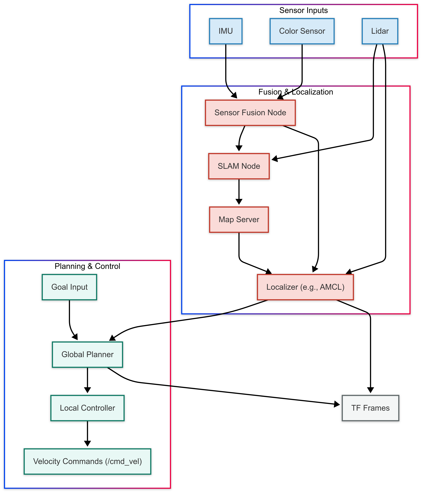
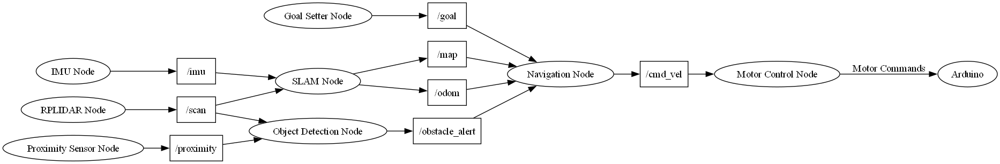
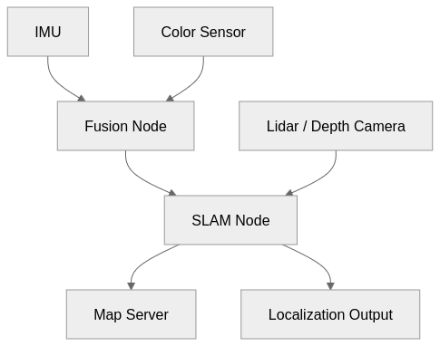
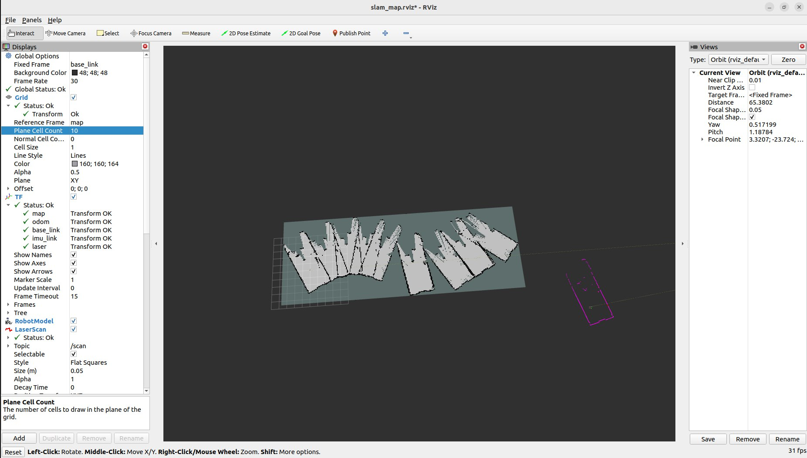
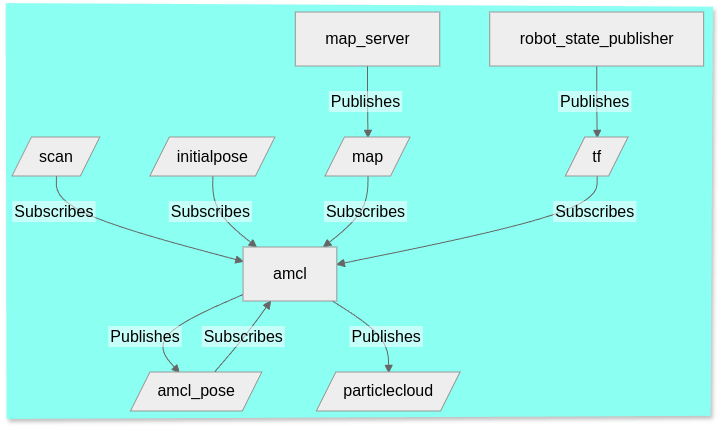
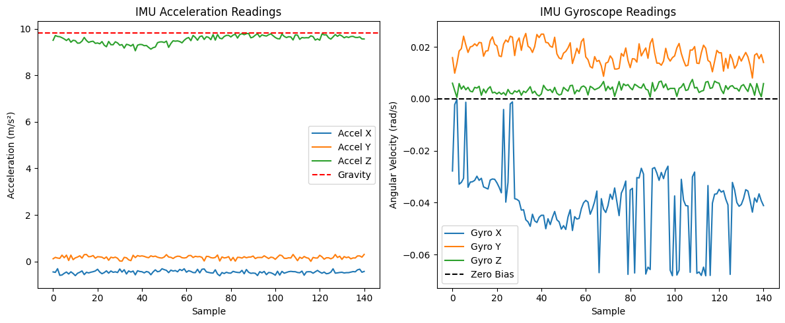
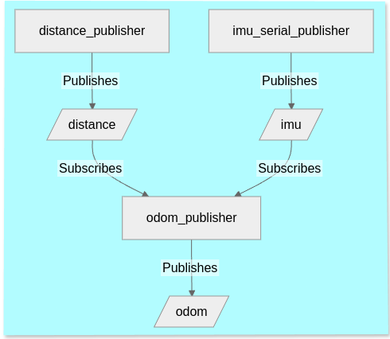

# SEAV ROS 2 Workspace

Software Engineering for Autonomous Vehicles.

---

## To-do
- [OK] Refactor nodes into composable containers for better performance
- [ ] Add diagnostics and real-time status publishers
- [OK] Set up automatic rosbag recording for every launch
- [ ] Create analysis notebooks in `docs/notebooks/`
- [OK] Integrate PlotJuggler or RQT for real-time visualization
- [ ] Add GitHub Actions for `colcon build` and `colcon test`
- [ ] Enforce formatting with `ament_lint`, `black`, `flake8`
- [OK] Create video demos and setup tutorials
- [ ] Optimization of varibales in nav2 yaml
- [ ] Further Adjustment based on the present vehicle
- [ ] Adding video of waypoint
---


## 🧭 Diagrams, Screenshots, and Media

This section provides a curated collection of diagrams, screenshots, and media that illustrate the internal workings and real-world implementation of the SEAV robot. These visual aids complement the technical documentation by offering a clearer understanding of the robot's architecture, behavior in simulation, sensor integrations, and testing procedures.

---

### 📊 System Design & Architecture

The following visuals explain the core architecture of our robotic system, how different ROS 2 nodes interact, and how various components such as sensors, control, and planning modules are layered in our implementation.

| Preview | Description |
|--------|-------------|
|  | A high-level view of key nodes in the Nav2 stack, including how topics are published and subscribed among them. This diagram helps trace the message flow from localization to control. |
|  | Shows the internal ROS 2 communication patterns, including topic and service-based interactions between custom and standard nodes. |
|  | A comprehensive block diagram that connects major subsystems: perception, localization, motion planning, and control logic. Each block represents a real ROS node or package in our setup. |
|  | Presents a clean breakdown of our layered robot software stack — starting from low-level hardware interfaces up to high-level decision-making and navigation. |
|  | Captured after launching the full stack, this graph visualizes the entire network of active nodes and topic connections. |
|  | An RQT-based node graph showing live data flow and topic communication during runtime. Useful for debugging and understanding ROS 2's decentralized architecture. |
|  | A 3D render of the robot created using Xacro/URDF files, showing component placements and joint definitions. |

---

### 🧭 Localization, SLAM & Sensor Fusion

This section includes visuals that depict how the SEAV robot performs mapping and localization using various sensor fusion techniques, including IMU and odometry. It also shows how SLAM performance improves with better sensor calibration.

| Preview | Description |
|--------|-------------|
|  | Outlines the structure of the SLAM pipeline used in simulation, including the TF tree and topic publishers/subscribers involved. |
|  | Demonstrates improved SLAM accuracy once raw IMU data was calibrated. This significantly reduced drift in long-duration tests. |
|  | A snapshot taken before integrating calibrated IMU data — drift in the map is clearly visible, highlighting the importance of sensor fusion. |
|  | A node-level diagram illustrating Adaptive Monte Carlo Localization (AMCL), which was used in static map-based localization scenarios. |
|  | Raw output from the IMU sensor showing noticeable noise before any calibration or filtering. |
|  | A flowchart that explains how odometry is calculated using combined data from an IMU and a wheel encoder-based distance sensor. |
|  | An RViz screenshot showing SLAM-generated maps, Nav2's local/global costmaps, and the navigation path. This illustrates the full pipeline from sensing to path planning. |

---

### ⚙️ Hardware, RViz & RQT Tools

Here we showcase hardware-level integration, RViz-based sensor visualization, and the use of RQT for real-time introspection of the ROS graph. These tools played a vital role during debugging, development, and field validation.

| Preview | Description |
|--------|-------------|
|  | Schematic representation of the wiring between the Arduino microcontroller, H-bridge motor driver, and onboard sensors. Essential for reproducing the robot setup. |
|  | RViz visualization of the real robot in action, with Lidar scans overlayed on the URDF model. Useful for verifying sensor alignment and robot pose. |
|  | A customized RQT layout showing active topics, node status, and real-time logging during tests. |
|  | A combined view of RQT's Topic Monitor and terminal output, helpful for tracking both message flow and debug output side-by-side. |

---

### 🤖 Real Robot Photos & Field Testing

Below are real-world snapshots of the robot used in lab and field environments, showing the hardware in action under various conditions.

| Preview | Description |
|--------|-------------|
|  | The physical robot used for all outdoor and indoor experiments. The chassis includes LiDAR, Arduino control, and an IMU setup. |
|  | A field photo captured during testing, showing the robot navigating autonomously in a controlled environment. |

---

### 🎥 Video Demonstrations

These short videos highlight specific capabilities of the SEAV robot, such as low-level motor control from ROS and fully autonomous point-to-point navigation.

> 🎬 **Real Car Control via `cmd_vel` → Arduino**  
[▶️ Watch Video](docs/images/real%20car%20drive%20controlling%20thorugh%20cmd_vel%20motor%20controller%20to%20arduino%20serial%20pro.mp4)  
This clip demonstrates how high-level velocity commands (`cmd_vel`) from ROS 2 are translated into serial messages that control the motors via an Arduino interface. It validates end-to-end motor control from the ROS navigation stack.

> 🎬 **Autonomous Navigation of Real Toy Car**  
[▶️ Watch Video](docs/images/shows%20real%20toy%20car%20running%20autonomously%20given%20initial%20and%20final%20points.mp4)  
The robot receives a start and goal position and autonomously computes and follows a global path using SLAM, costmaps, and Nav2 planners. The video confirms real-world applicability of the simulated navigation pipeline.


---

### 📦 ROS 2 Bag Recording Overview

To validate the runtime behavior of the SEAV robot, a rosbag was recorded during a live navigation session. The bag includes TF transforms, odometry, LIDAR scans, AMCL poses, and diagnostics among others. This data is essential for offline analysis, visualization, and debugging.

- **Recording Folder**: `docs/rosbag/rosbag2_2025_03_30-14_47_38/`
- **File Size**: Contains a single SQLite3 `.db3` file and a `metadata.yaml`.
- **Total Duration**: ~546 seconds (≈9 minutes)
- **Message Count**: 53,909 messages
- **ROS 2 Version**: Tested with ROS 2 Humble-based setup
- **Storage Format**: `sqlite3`
- **Start Time**: Unix nanoseconds: `1743338858570917969`

#### Topics Recorded
Below is a summary of key topics and their message counts:

| Topic Name                      | Msg Type                               | Messages |
|--------------------------------|----------------------------------------|----------|
| `/tf`                          | `tf2_msgs/msg/TFMessage`               | 6345     |
| `/odom`                        | `nav_msgs/msg/Odometry`               | 5423     |
| `/imu`                         | `sensor_msgs/msg/Imu`                 | 5458     |
| `/cmd_vel`                     | `geometry_msgs/msg/Twist`            | 261      |
| `/map`                         | `nav_msgs/msg/OccupancyGrid`         | 47       |
| `/initialpose`                | `geometry_msgs/msg/PoseWithCovarianceStamped` | 2 |
| `/diagnostics`                | `diagnostic_msgs/msg/DiagnosticArray` | 299      |
| `/rosout`                      | `rcl_interfaces/msg/Log`              | 14,021   |
| `/distance`                    | `std_msgs/msg/Float32`                | 537      |
| `/map_metadata`               | `nav_msgs/msg/MapMetaData`           | 46       |
| `/tf_static`                   | `tf2_msgs/msg/TFMessage`              | 5424     |

>  *This data will be replayed using `ros2 bag play` for RViz visualization, algorithm tuning, and mapping evaluation.*

---

## 📚 Table of Contents

- [TF Tree](#tf-tree)
- [Package Overview](#package-overview)
- [How to Build](#how-to-build)
- [How to Run Packages](#how-to-run-packages)
- [Folder Structure](#folder-structure)
- [Requirements](#requirements)

---

## 📦 Package Overview

### 1. **seav_test_sensors**
Collects and publishes data from IMU, distance sensor, and odometry.

- **Nodes:** `imu_serial_publisher`, `distance_publisher`, `odom_publisher`
- **Publishes:** `/imu`, `/distance`, `/odom`
- **Subscribes:** `/imu`, `/distance`
- **Dependencies:** `rclpy`, `robot_localization`, `tf2_ros`
- **Launch File:** `ekf.launch.py`
- **Status:** ✅ Built

---

### 2. **rplidar_ros**
Driver package for RPLIDAR A1.

- **Publishes:** `/parameter_events`, `/rosout`
- **Launch File:** `ekf.launch.py`
- **Status:** ✅ Built

---

### 3. **my_nav2_pkg**
Configurations and launch files for ROS 2 Nav2 stack.

- **Nodes:** `robot_state_publisher`, `map_server`, `amcl`, etc.
- **Publishes:** `/tf`, `/map`, `/amcl_pose`, `/cmd_vel`
- **Subscribes:** `/scan`, `/goal_pose`, `/map`
- **Launch Files:** `nav2.launch.py`, `bringup.launch.py`, etc.
- **Status:** ✅ Built

---

### 4. **my_robot_controller**
Forwards velocity commands from `/cmd_vel` to Arduino.

- **Publishes/Subscribes:** `/cmd_vel`, `/rosout`
- **Status:** ✅ Built

---

### 5. **static_tf_publisher**
Publishes static TFs between `base_link`, `imu`, and `lidar`.

- **Node:** `static_transform_publisher`
- **Launch File:** `static_tf_publisher.launch.py`
- **Status:** ✅ Built

---

### 6. **seav_description**
Contains robot URDF/Xacro, meshes, and worlds for Gazebo simulation.

- **URDF:** Modular robot description using `xacro` files
- **Mesh:** `lidar.dae`
- **Launch File:** `bot.launch.py`
- **Worlds:** `empty.world`
- **Status:** ✅ Built

---

### 7. **seav_simulation**
Provides simulation environments and maps for testing and SLAM.

- **Launch Files:**  
  - `autonomous_navigation.launch.py`  
  - `house_sim.launch.py`  
  - `house_slam.launch.py`  
  - `outdoor.launch.py`
- **Maps:** `house_map.pgm`, `house_map.yaml`
- **Worlds:** `house.world`, `bookstore.world`
- **Configs:** `ekf.yaml`, `nav2_params.yaml`
- **Status:** ✅ Built

---

## ▶️ How to Replicate the Workspace

> This guide walks through bringing up your ROS 2-based robot in **three structured phases**: sensors, actuators, and navigation.

---

### 🔧 Requirements Before You Begin

- Ensure your robot is connected and powered.
- Make sure you have access to the correct USB ports (e.g., `/dev/ttyUSB0`, `/dev/ttyUSB1`).
- Confirm that `install/setup.bash` exists and is sourced.
- Grant necessary permissions for devices: `sudo chmod 666 /dev/ttyUSB*`

---

## ▶️ PHASE 1: Base + Sensors Only

### 📄 Script: `bringup_phase1.sh`

```bash
#!/bin/bash
SESSION=ros_dev
WORKSPACE="/home/pi/seav"

# Launch robot state publisher
tmux new-session -d -s $SESSION -n rsp \
  "source $WORKSPACE/install/setup.bash && ros2 launch seav_description rsp.launch.py"

# Launch RPLIDAR
tmux new-window -t $SESSION -n rplidar \
  "source $WORKSPACE/install/setup.bash && ros2 launch rplidar_ros rplidar_a1_launch.py"

# Launch sensor publishers
tmux new-window -t $SESSION -n distance_pub \
  "source $WORKSPACE/install/setup.bash && ros2 run seav_test_sensors distance_publisher"

tmux new-window -t $SESSION -n imu_pub \
  "source $WORKSPACE/install/setup.bash && ros2 run seav_test_sensors imu_serial_publisher"

tmux new-window -t $SESSION -n odom_pub \
  "source $WORKSPACE/install/setup.bash && ros2 run seav_test_sensors odom_publisher"

tmux attach -t $SESSION
```

### ✅ Phase 1 Checks

```bash
source /home/pi/seav/install/setup.bash
ros2 topic list
ros2 topic echo /scan
ros2 topic echo /imu
ros2 topic echo /odom
ros2 run tf2_tools view_frames
```

In RViz2:
- Fixed Frame: `base_link` or `base_footprint`
- Add Displays: `TF`, `LaserScan`, `IMU`, `Odometry`, `RobotModel`

---

## ▶️ PHASE 2: Add Actuators + SLAM

### 📄 Script: `bringup_phase2.sh`

```bash
#!/bin/bash
SESSION=ros_dev
WORKSPACE="/home/pi/seav"

# Launch motor controller
tmux new-session -A -t $SESSION -n motor_ctrl \
  "source $WORKSPACE/install/setup.bash && ros2 run my_robot_controller serial_motor_controller"

# Launch SLAM Toolbox
tmux new-window -t $SESSION -n slam_toolbox \
  "source $WORKSPACE/install/setup.bash && ros2 run slam_toolbox async_slam_toolbox_node \
   --ros-args --params-file $WORKSPACE/src/seav_slam/mapper_params_online_async.yaml"

# (Optional) Save the map after mapping
# ros2 run nav2_map_server map_saver_cli -f /home/pi/k11_room_map

tmux attach -t $SESSION
```

### ✅ Phase 2 Checks

- `ros2 topic echo /map`
- In RViz2:
  - Add: `/map`, `/scan`, `/odom`
  - Confirm map grows as the robot moves

---

## ▶️ PHASE 3: Localization, Navigation, and EKF

### 📄 Script: `bringup_phase3.sh`

```bash
#!/bin/bash
SESSION=ros_dev
WORKSPACE="/home/pi/seav"
MAP_FILE="$WORKSPACE/src/my_nav2_pkg/config/maze_map_save.yaml"

# Launch EKF node
tmux new-session -A -t $SESSION -n ekf \
  "source $WORKSPACE/install/setup.bash && ros2 launch my_robot_description ekf_launch.py"

# Launch localization using saved map
tmux new-window -t $SESSION -n nav2_local \
  "source $WORKSPACE/install/setup.bash && ros2 launch my_nav2_pkg localization_launch.py map:=$MAP_FILE"

# Launch full navigation stack
tmux new-window -t $SESSION -n nav2_nav \
  "source $WORKSPACE/install/setup.bash && ros2 launch my_nav2_pkg navigation_launch.py"

tmux attach -t $SESSION
```

### ✅ Phase 3 Checks

- `ros2 topic echo /odom`
- `ros2 topic echo /odom_filtered`
- Confirm that the following nodes are active:
  - `/amcl`
  - `/controller_server`
  - `/planner_server`
- In RViz2:
  - Add: `2D Pose Estimate`, `2D Goal`
  - Set goals and observe robot behavior

---

## ▶️ Execution Instructions

```bash
chmod +x bringup_phase1.sh bringup_phase2.sh bringup_phase3.sh

# Phase 1: Sensors + TF
./bringup_phase1.sh

# After validating TF and sensor topics
./bringup_phase2.sh

# After successful SLAM mapping
./bringup_phase3.sh
```

---

### 🧠 Tmux Tips

- Switch windows: `Ctrl + B`, then press `w`
- Kill session: `Ctrl + B`, then type `:kill-session`

---

## ✅ Phase Summary

| Phase   | Functionality                          |
|---------|----------------------------------------|
| Phase 1 | Robot model + Sensors + TF             |
| Phase 2 | Actuators + SLAM mapping               |
| Phase 3 | EKF + Localization + Navigation goals  |

---


## 📁 Folder Structure

```
ros2_ws/
├── src/
│   ├── my_nav2_pkg/
│   ├── my_robot_controller/
│   ├── rplidar_ros/
│   ├── seav_description/
│   ├── seav_simulation/
│   ├── seav_slam/
│   ├── seav_test_sensors/
│   ├── static_tf_publisher/
│   └── scripts/
├── docs/
│   ├── images/  ← TF tree, architecture, circuit diagrams, etc.
│   ├── notebooks/
│   ├── ppt/
│   └── ros2_workspace_documentation.xlsx
├── README.md
├── build/
├── install/
└── log/

---

---

## 🐞 Troubleshooting & Debugging Tips

Use this section to quickly diagnose and fix common bring-up issues in each phase, using topics, TFs, RViz, and ROS 2 logs.

---

### 🔧 General Debugging Tips

| Check                      | Command                              |
|---------------------------|--------------------------------------|
| List all topics           | `ros2 topic list`                    |
| Inspect a topic           | `ros2 topic echo /topic_name`        |
| List active nodes         | `ros2 node list`                     |
| View TF frame tree        | `ros2 run tf2_tools view_frames`     |
| Visualize in RViz         | `ros2 run rviz2 rviz2`               |
| View running processes    | `htop` or `top`                      |
| Check connected USB ports | `ls /dev/ttyUSB*`                    |

---

### 🛠️ Phase 1 Issues (Sensors + TF)

| Problem                   | Likely Cause                             | Fix                                                        |
|--------------------------|-------------------------------------------|-------------------------------------------------------------|
| Robot not visible in RViz| `robot_state_publisher` or URDF error     | Check `rsp.launch.py` and verify URDF validity              |
| Wheels not visible       | Missing `joint_state_publisher` or TFs    | Run: `ros2 run joint_state_publisher joint_state_publisher` |
| No TF frames in RViz     | TFs not being published                   | Ensure `robot_state_publisher` is running                   |
| IMU or Lidar not publishing | Serial port or USB not detected        | Run `ls /dev/ttyUSB*` and update the correct port           |
| Permission denied on USB | Insufficient access to `/dev/ttyUSB*`     | Run: `sudo chmod 666 /dev/ttyUSB*`                          |

---

### 🛠️ Phase 2 Issues (Actuators + SLAM)

| Problem             | Likely Cause                               | Fix                                                     |
|--------------------|---------------------------------------------|----------------------------------------------------------|
| No map data `/map` | SLAM node not running or missing input      | Check `async_slam_toolbox_node` logs                     |
| Map not updating    | Wrong RViz frame or missing `/scan`        | Set RViz fixed frame to `map`, confirm laser topic       |
| Robot not moving    | Motor controller misconfigured or not running | Check serial port and controller node output           |

---

### 🛠️ Phase 3 Issues (EKF + Navigation)

| Problem                   | Likely Cause                          | Fix                                                       |
|--------------------------|----------------------------------------|------------------------------------------------------------|
| Navigation goal not executing | AMCL not initialized             | Use `2D Pose Estimate` in RViz                             |
| No path planned          | Map not loaded or pose TFs broken      | Verify `map_server` and `robot_pose` TF tree               |
| Odometry unstable        | EKF config issue or noisy IMU input    | Tune EKF parameters or check `/imu` and `/odom` topics     |
| Nav2 nodes crash         | YAML or parameter error                | Check `localization_launch.py` and `navigation_launch.py`  |

---

### 📄 Debugging Through Logs

ROS 2 nodes automatically save logs. These are critical for understanding crashes, parameter errors, and startup problems.

#### 🔍 Find logs for a node:
```bash
ros2 node info /your_node_name
```

#### 📁 Default log file location:
```bash
~/.ros/log/latest_log/
```

Each node creates a subfolder with its PID. Inside, you'll find:
- `stdout.log` — standard output
- `stderr.log` — error messages

You can inspect them with:

```bash
cat ~/.ros/log/latest_log/<node_folder>/stderr.log
```

#### 🧪 Real-time log viewing (if using tmux):

- Switch to the node's tmux window to see logs as they stream.
- To scroll in tmux:
  - Press `Ctrl + B`, then `[`
  - Use arrow keys to scroll
  - Press `q` to exit scroll mode

#### 🎛️ Set logging verbosity (optional):

```bash
export RCUTILS_LOGGING_SEVERITY_THRESHOLD=INFO
export RCUTILS_CONSOLE_OUTPUT_FORMAT="[{severity}] [{name}]: {message}"
```

---


## 🛠 Requirements

- **ROS 2 Distro:** (Humble)
- **Tools:**  
  - `colcon`  
  - `xacro`  
  - `rviz2`  
  - `robot_localization`  
  - `nav2_bringup`

## References
## References

1. ROS 2 Humble
2. SLAM Toolbox (Async & Localization Modes)
3. Navigation2 (Nav2)
4. `ros2_control` and `ros2_controllers`
5. URDF/Xacro (using XML 1.0)
6. `robot_localization` (EKF-based sensor fusion)
7. Joint State Publisher + GUI
8. RViz2 (Visualization tool)
9. `tmux` (Process manager for bring-up scripts)
10. `colcon` (ROS 2 build system)
11. Joshnewans Articubot git repo and youtube channel
12. https://github.com/mad-lab-fau/imucal (imu callibration based on ferrais)
